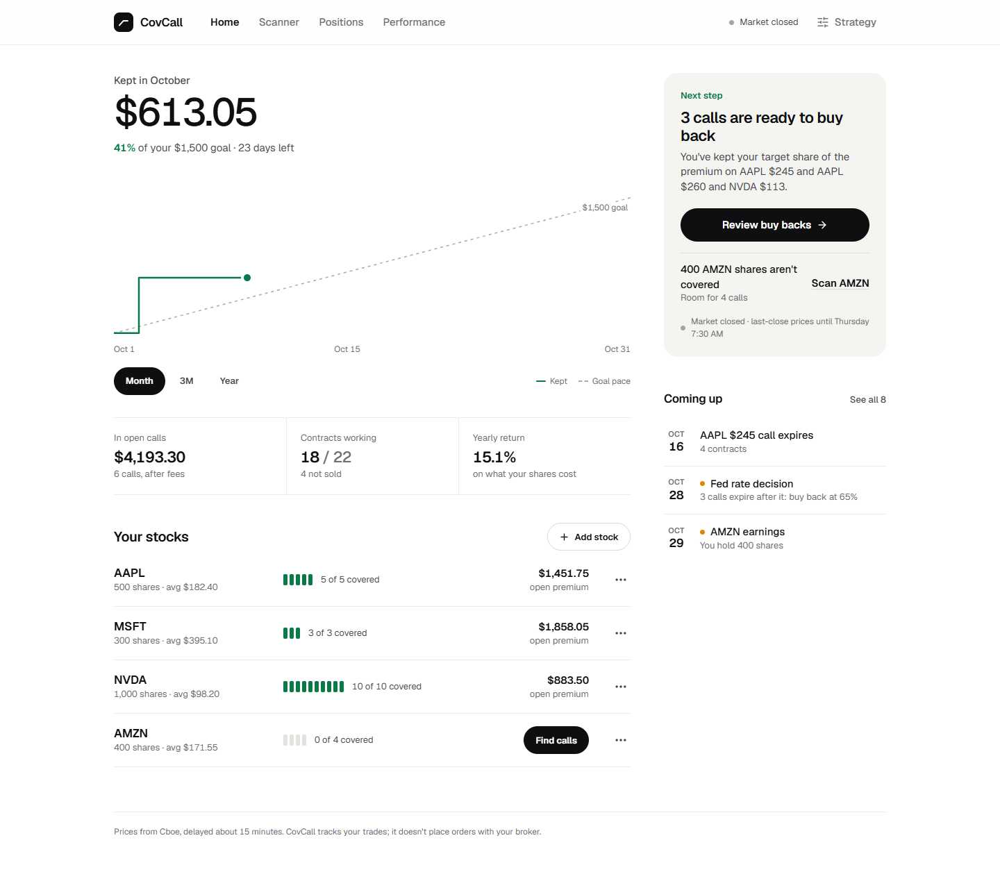

# Covered Call Scanner

A full-stack financial tool for scanning, planning, and managing covered call options positions. Built with Python (FastAPI) and React.

**Developed by Thai Nguyen** · [GitHub](https://github.com/Tys0n4)

**Live demo:** [covered-call-bot.vercel.app](https://covered-call-bot.vercel.app) · **API docs:** [covered-call-bot-production.up.railway.app/docs](https://covered-call-bot-production.up.railway.app/docs)


## Overview

Covered Call Scanner automates the process of finding, evaluating, and tracking covered call opportunities for stock positions you already own. Instead of manually scanning options chains, the app fetches live market data, picks calls within your chance-of-being-called range that keep you on pace for your monthly goal, and builds a contract allocation plan that maintains a configurable 70/30 income-to-balanced split across your portfolio.

It doesn't place trades: you place them at your broker, and CovCall tells you what to enter and records what happened.

## Features

- **Live option prices** — Cboe's delayed quotes (about 15 minutes behind), with Yahoo Finance as the fallback
- **Buy-back guidance** — tells you when a call is ready to buy back and the order to place at your broker, with an optional Discord alert
- **Event awareness** — earnings, Fed decisions, industry earnings and ex-dividend dates before expiry are flagged, and picks lean to the safe end of your range
- **Real records** — what your broker actually filled, rolls in one step, and shares called away
- **Honest results** — performance after buybacks and fees, compared with just holding the shares

How each of these works, from the pick math to the buy-back rules, is in **[How it works](docs/how-it-works.md)**.

## Screenshots

*Demo portfolio with simulated market data.*

**Scanner** — one recommended trade for a stock, with the calls behind it and boxes for what you actually sold at.


**Positions** — open calls grouped into Ready to buy back, Going against you and Holding, with the order to place at your broker.


**Record a roll** — the prices from your broker, per share, with the net credit or debit worked out.


**Performance** — what selling calls added compared with just holding, month by month against your goal.


**Light theme and phone**

 

## Tech Stack

| Layer       | Technology                          |
|-------------|-------------------------------------|
| Backend     | Python, FastAPI, Uvicorn            |
| Data        | Cboe delayed quotes, yfinance, Alpha Vantage API, pandas |
| Frontend    | React, Vite, Tailwind CSS           |
| State       | React Context API, localStorage (theme, filters) |
| Persistence | Postgres (SQLite locally), SQLAlchemy |
| Deployment  | Vercel (frontend), Railway (backend)|

## Getting Started

You need Python 3.11+ and Node.js 22+.

```bash
git clone https://github.com/Tys0n4/covered-call-bot.git
cd covered-call-bot
pip install -r requirements.txt

# Start the API (docs at http://localhost:8000/docs)
uvicorn api.main:app --app-dir backend --reload --port 8000

# In a second terminal, start the app (http://localhost:5173)
cd web
npm install
npm run dev
```

Without `DATABASE_URL`, an empty local SQLite database is created at `backend/covcall.db`. Add your stocks from Home.

<details>
<summary><strong>Environment variables</strong></summary>

Create `backend/.env` for local development. An [Alpha Vantage](https://www.alphavantage.co) key is optional (free): a backup stock price source when Cboe doesn't answer.

```
ALPHA_VANTAGE_KEY=your_key_here
```

Server settings (set these on Railway, or export them locally):

| Variable          | What it does |
|-------------------|--------------|
| `APP_PASSWORD`    | Password for the app's login screen. **Set this on any server others can reach**; without it the API is open to anyone. Leave unset for local development. |
| `AUTH_SECRET`     | Optional. Key used to sign login tokens. Defaults to one derived from `APP_PASSWORD`, so changing the password logs everyone out. |
| `AUTH_TOKEN_DAYS` | Optional. How long a login lasts (default 30). |
| `DATABASE_URL`    | Postgres connection string. Leave unset to use a local SQLite file. |
| `APP_TIMEZONE`    | Time zone for trade dates (default `America/Edmonton`). |
| `ALERTS_KEY`      | Optional. Lets a scheduler run the buy-back alert check; see [Buy-back alerts](docs/how-it-works.md#buy-back-alerts-discord). |

</details>

## Tests

```bash
pip install -r requirements-dev.txt
pytest
ruff check backend tests
cd web && npm run lint && npm run build
```

The tests use a fake market and a temporary SQLite database, so they need no API keys or network. GitHub Actions runs the same checks on every pull request and on pushes to `main`.

## Reference

**API** — interactive docs at [/docs](https://covered-call-bot-production.up.railway.app/docs). With `APP_PASSWORD` set, every endpoint except `/`, `/health`, `/market` and `/auth/*` needs an `Authorization: Bearer <token>` header from `/auth/login`. `/alerts/cron` uses the `X-Alerts-Key` header instead.

<details>
<summary><strong>Project structure</strong></summary>

```
covered-call-bot/
├── backend/
│   ├── api/                  # FastAPI app: main.py (entry), auth.py, schemas.py
│   │   └── routes/           # portfolio, scan, positions, manage, performance, settings, alerts, upcoming
│   ├── core/                 # Covered call logic (see core/__init__.py for a module map)
│   │   ├── scanner.py        # Scan pipeline: price, chain, filters, picks, warnings
│   │   ├── planner.py        # Turns a scan into the trade to place, for your split
│   │   ├── positions.py      # Save, close, roll, assign, edit, undo, delete calls
│   │   ├── buyback.py        # "Check prices": time to buy back?
│   │   ├── assignment.py     # Expired calls that were probably assigned
│   │   ├── performance.py    # Realized results and return on capital
│   │   ├── market_data.py    # Stock price, earnings/ex-dividend dates
│   │   ├── events.py         # Fed meeting dates, industry leaders, related earnings
│   │   ├── cboe.py           # Option chains from Cboe's delayed quotes
│   │   ├── options_data.py   # Option chains: Cboe, else Yahoo
│   │   ├── market_hours.py   # NYSE hours, holidays, early closes
│   │   ├── db.py             # Database tables (Postgres, or SQLite locally)
│   │   └── ...               # filters, quotes, calculations, greeks, scoring, strategy, ...
├── tests/                    # pytest suite (fake market, temporary database)
├── web/                      # React frontend (Vite), deployed to Vercel
│   └── src/
│       ├── pages/            # Dashboard (Home), Scanner, Positions, Performance, Strategy, Login
│       ├── components/       # Shared UI (Layout, PageHeader, InfoTip, ...)
│       │   └── dialogs/      # Pop-up dialogs (add, close, roll, edit, holding)
│       ├── context/          # Login, theme, market status, toasts and the selected stock
│       ├── api/client.js     # Calls to the backend
│       └── lib/              # Formatting, P&L and strategy helpers
├── docs/                     # How it works, screenshots
├── requirements.txt          # Backend dependencies (pinned)
├── railway.toml              # Railway start command
└── .github/workflows/ci.yml  # Tests, lint and build on every pull request
```

</details>

## License

MIT License — feel free to use, modify, and distribute.
