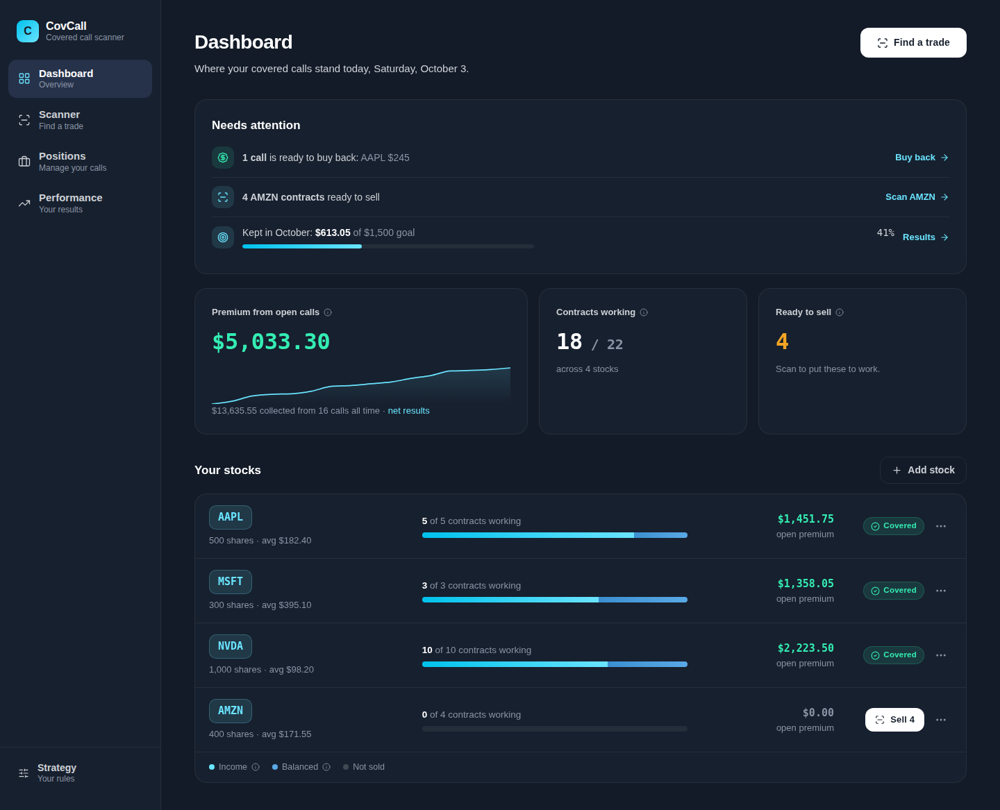
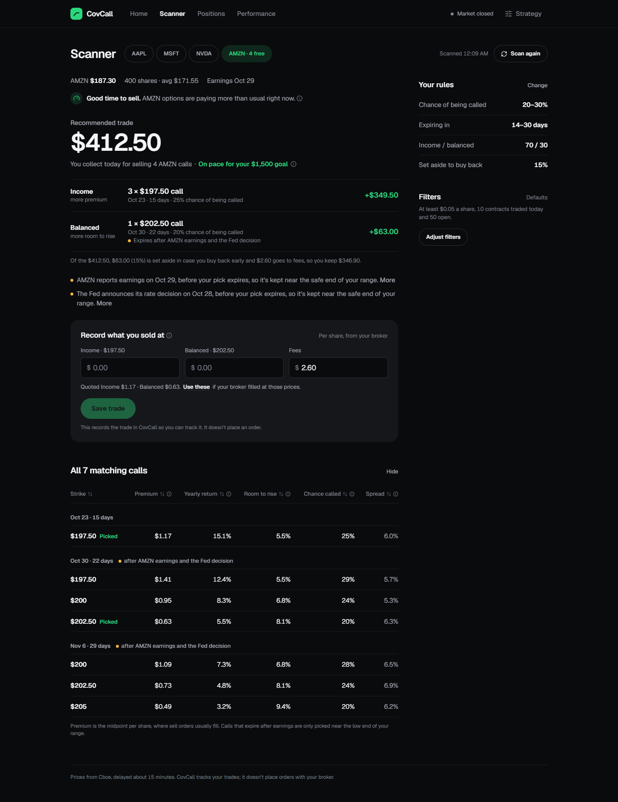
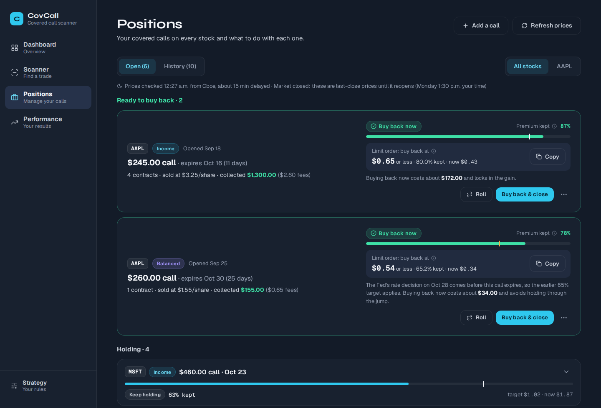
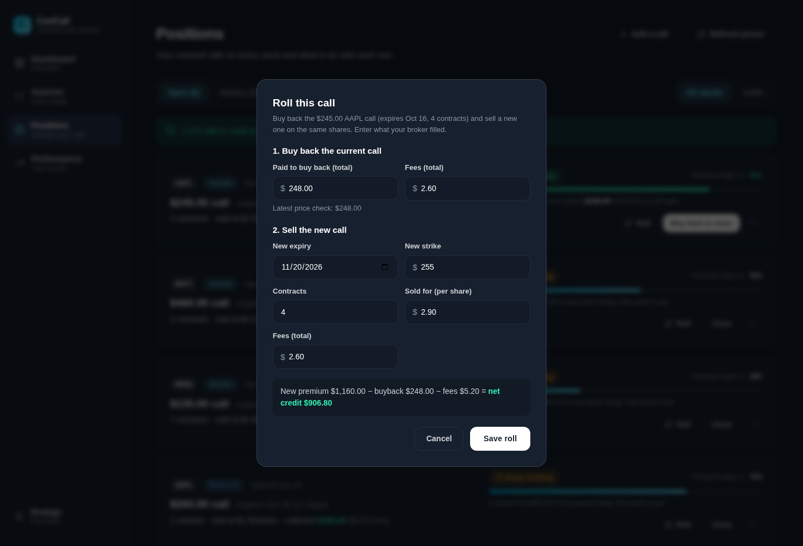
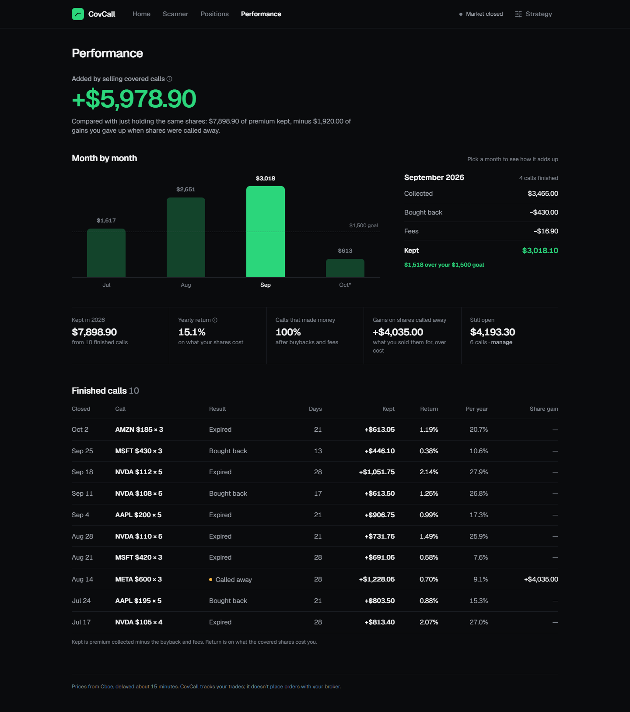
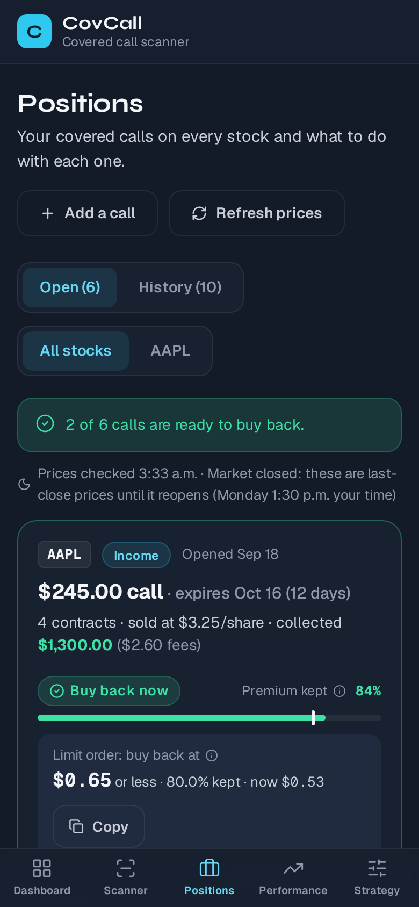

# Covered Call Scanner

A full-stack financial tool for scanning, planning, and managing covered call options positions. Built with Python (FastAPI) and React.

**Developed by Thai Nguyen** · [GitHub](https://github.com/Tys0n4)

---

## Live Demo

**Frontend:** https://covered-call-bot.vercel.app  
**API Docs:** https://covered-call-bot-production.up.railway.app/docs

---

## Overview

Covered Call Scanner automates the process of finding, evaluating, and tracking covered call opportunities for stock positions you already own. Instead of manually scanning options chains, the app fetches live market data, scores candidates by income potential and risk profile, and builds a contract allocation plan that maintains a configurable 70/30 income-to-balanced split across your portfolio.

---

## Features

- **Live options scanning** — options chains from Yahoo Finance (yfinance); stock price from Alpha Vantage with an automatic Yahoo fallback; NYSE holidays and early closes handled
- **Baseline strategy** — calls with a 20–30% chance of being called (delta 0.20–0.30), 14–30 days out, picked to reach your monthly goal with as little risk as possible; every part is editable on the Strategy page
- **Candidate scoring** — ranks options by monthly income after fees, delta, bid-ask spread quality, and volume
- **Smart allocation** — maintains a 70/30 income/balanced contract split per ticker, accounting for already-open positions
- **Position management** — tracks open covered call positions and evaluates buyback opportunities based on profit capture %
- **Buy-back alerts** — a Discord message when an open call reaches your buy-back target, checked every 15 minutes during market hours
- **Real fills and fees** — record the price your broker actually filled and your commissions when you sell, buy back or roll
- **Rolling** — buy back a call and sell a new one on the same shares in one step
- **Assignment tracking** — record shares called away (early or at expiry); calls that expired in the money are flagged for review
- **Event awareness** — expiries that span earnings, a Fed rate decision, or earnings from the stock's industry leaders and your other stocks in the same industry are flagged, and picks lean to the safe end of your range; ex-dividend dates are flagged too
- **Performance** — realized results by month, net after buybacks and fees, gains on shares called away, and yearly return on capital
- **Multi-ticker support** — manage covered calls across multiple stock positions independently
- **REST API** — FastAPI backend with auto-generated interactive docs at `/docs`
- **React app** — dark-themed, works on desktop and phones

---

## Screenshots

*Demo portfolio with simulated market data.*

**Dashboard** — a "Needs attention" list (calls to buy back, contracts to sell, calls expiring soon, your monthly goal), then one row per stock.



**Scanner** — a recommended trade split into income and balanced calls, your actual fills, the two top picks, and warnings such as earnings before expiry.



**Positions** — every open call across your stocks, with live prices checked automatically to show which are ready to buy back. Roll and Close sit on each card; Edit and Delete are in the ⋯ menu, and changes can be undone.



**Roll a call** — buy back and sell a new call in one step, with the net credit or debit worked out.



**Performance** — what you kept after buybacks and fees, yearly return on capital, gains on shares called away, and a month-by-month chart against your goal.



**On a phone**



---

## Tech Stack

| Layer       | Technology                          |
|-------------|-------------------------------------|
| Backend     | Python, FastAPI, Uvicorn            |
| Data        | yfinance, Alpha Vantage API, pandas |
| Frontend    | React, Vite, Tailwind CSS           |
| State       | React Context API, localStorage     |
| Persistence | Postgres (SQLite locally), SQLAlchemy |
| Deployment  | Vercel (frontend), Railway (backend)|

---

## Project Structure

```
covered-call-bot/
├── backend/
│   ├── api/                  # FastAPI app: main.py (entry), auth.py, schemas.py
│   │   └── routes/           # portfolio, scan, positions, manage, performance, settings
│   ├── core/                 # Covered call logic (see core/__init__.py for a module map)
│   │   ├── scanner.py        # Scan pipeline: price, chain, filters, scoring, warnings
│   │   ├── planner.py        # Turns a scan into the trade to place, for your split
│   │   ├── positions.py      # Save, close, roll, assign, edit, undo, delete calls
│   │   ├── buyback.py        # "Check prices": time to buy back?
│   │   ├── assignment.py     # Expired calls that were probably assigned
│   │   ├── performance.py    # Realized results and return on capital
│   │   ├── market_data.py    # Stock price, earnings/ex-dividend dates
│   │   ├── events.py         # Fed meeting dates, industry leaders, related earnings
│   │   ├── options_data.py   # Option chains from Yahoo
│   │   ├── market_hours.py   # NYSE hours, holidays, early closes
│   │   ├── db.py             # Database tables (Postgres, or SQLite locally)
│   │   └── ...               # filters, quotes, calculations, greeks, scoring, strategy, ...
├── tests/                    # pytest suite (fake market, temporary database)
├── web/                      # React frontend (Vite), deployed to Vercel
│   └── src/
│       ├── pages/            # Dashboard, Scanner, Positions, Performance, Strategy, Login
│       ├── components/       # Shared UI (Layout, PageHeader, InfoTip, ...)
│       │   └── dialogs/      # Pop-up dialogs (add, close, roll, edit, holding)
│       ├── context/          # Login state and the selected stock
│       ├── api/client.js     # Calls to the backend
│       └── lib/              # Formatting, P&L and strategy helpers
├── docs/screenshots/
├── requirements.txt          # Backend dependencies (pinned)
├── railway.toml              # Railway start command
└── .github/workflows/ci.yml  # Tests, lint and build on every pull request
```

---

## Getting Started

### Prerequisites

- Python 3.11+
- Node.js 22+
- Alpha Vantage API key (free at [alphavantage.co](https://www.alphavantage.co))

### 1. Clone the repo

```bash
git clone https://github.com/Tys0n4/covered-call-bot.git
cd covered-call-bot
```

### 2. Install Python dependencies

```bash
pip install -r requirements.txt
```

### 3. Set up environment variables

Create `backend/.env` (used for local development):

```
ALPHA_VANTAGE_KEY=your_key_here
```

Server settings (set these on Railway, or export them locally):

| Variable          | What it does |
|-------------------|--------------|
| `APP_PASSWORD`    | Password for the app's login screen. **Set this on any server others can reach**; without it the API is open to anyone. Leave unset for local development. |
| `AUTH_SECRET`     | Optional. Key used to sign login tokens. Defaults to one derived from `APP_PASSWORD`, so changing the password logs everyone out. |
| `AUTH_TOKEN_DAYS` | Optional. How long a login lasts (default 30). |
| `DATABASE_URL`    | Postgres connection string. Leave unset to use a local SQLite file. |
| `APP_TIMEZONE`    | Time zone for trade dates (default `America/Edmonton`). |

### 4. Start the API

```bash
uvicorn api.main:app --app-dir backend --reload --port 8000
```

API docs available at [http://localhost:8000/docs](http://localhost:8000/docs)

Without `DATABASE_URL`, an empty local SQLite database is created at `backend/covcall.db`. Add your stocks from the Dashboard.

### 5. Install and start the frontend

```bash
cd web
npm install
npm run dev
```

Open [http://localhost:5173](http://localhost:5173)

---

## How It Works

### Scanning

The scanner fetches the options chain for a ticker within your expiry window (14–30 days by default). Each candidate is filtered by:

- Your delta range: the chance of being called, 20%–30% by default. This is the main risk rule.
- Minimum premium, volume, and open interest
- Optional minimum distance above the stock price (off by default; set it on the Scanner)
- Maximum bid-ask spread (35% of the mid price)

Each option is priced at what you can realistically get when selling: a quarter of the way from the bid to the ask, not the midpoint, so wide spreads cost you in the ranking. Your usual commission per contract is subtracted (learned from the fees you've recorded, $0.65 until then), and yields are on what's left. Options that pay less than the commission are dropped.

Each scan also says whether premiums are **rich**, **normal** or **thin** right now: it compares the yearly move near-the-money options are priced for (implied volatility) with how much the stock actually moved over the last 20 trading days. Rich (implied at least 1.25× realized) is a good time to sell; thin (implied below realized) means you're paid less than the risk, and waiting may pay more.

From the options in your range the scanner picks two:

- **Balanced** — the best monthly income near the safe end of your range (within 3 points of your lowest delta).
- **Income** — the lowest-delta option that, blended with the balanced pick at your income/balanced split, reaches your monthly goal. Your goal is spread across every contract your holdings can cover, so each contract has a monthly pace to hit. If no option in range reaches it, the best payer is picked and the Scanner says you're short. With no goal set, the best payer in range is picked.

Monthly income is what you expect to keep per contract: the premium × your buy-back target (the earlier event target when earnings or a Fed decision comes first), minus the commission to sell and the one to buy back, ÷ days to expiry × 30.4. The goal check uses the same number, so "on pace" means after buy-backs.

**Chance of being called (delta)** is Black-Scholes delta, lowered slightly for dividend payers. Its volatility comes from Yahoo's implied volatility; outside market hours Yahoo reports roughly zero there, so it's worked out from each option's own price instead, or from the stock's recent moves as a last resort. The Scanner says when it's using these estimates. A quiet strike whose last trade is from before the latest session is marked **Old price**: the stock has moved since, so that price doesn't set its volatility and the picks skip it.

**Events.** When earnings, a Fed rate decision (FOMC dates in `backend/core/events.py`), or earnings from the industry's largest companies or your other stocks in the same industry fall before an option's expiry, it's flagged and both picks stay within 3 points of your lowest delta. Industry comes from Yahoo Finance; the leaders list is in `backend/core/events.py`. Only confirmed Fed dates go there; when an expiry runs past the last one, the Scanner says the calendar ends there.

### Allocation

The planner maintains a **70/30 income/balanced split** across the total available contracts from your shares. It reads existing open positions and calculates how many contracts of each type are still needed to reach the target — so it always plans the right amount regardless of what's already open.

### Management

The management module fetches the current ask price for each open position and calculates profit captured vs the original entry price. Each call gets one of three recommendations:

- **Buy back now**: the call's ask is at or below your **buy-back price**. That's your target share of the premium kept (85% by default) turned into a price per share: what you sold for × (1 − target), rounded to the closest cent, since options trade in whole cents. Sold at $0.34: 85% kept is $0.051, so the buy-back price is $0.05 (85.3% kept). Sold at $0.38: $0.057 rounds to $0.06 (84.2% kept), which is closer than $0.05. Half a cent rounds down, and it's never below $0.01. If earnings or a Fed decision comes before the call expires, the earlier event target applies (65% by default). Both targets are set on the Strategy page; Positions and the Discord alerts show the price to set as a limit order.
- **Let it expire**: past the target, but it expires within a week with the stock at least 5% below the strike and no event before expiry. Buying back would mostly pay the spread and commission for very little risk removed.
- **Keep holding**: not at the target yet.

Buyback costs include your usual commission. Discord alerts are only sent for "Buy back now".

From the Positions page you can close a call (bought back, with cost and fees), roll it into a new one, or record that your shares were called away. When a call expires with the stock above the strike, the app asks you to confirm whether it was assigned instead of assuming.

### Buy-back alerts (Discord)

When an open call reaches your buy-back target, the app can post a message to a Discord channel. Each call is alerted once.

1. **Discord:** in the channel you want, open *Edit Channel → Integrations → Webhooks → New Webhook* and copy the webhook URL.
2. **App:** paste it under *Buy-back alerts* on the Strategy page and click Connect. A test message is sent right away.
3. **GitHub:** the scheduled workflow `.github/workflows/alerts.yml` wakes the API every 15 minutes on weekdays and calls `POST /alerts/check`, which does nothing while the market is closed. If the API has a password, add it as a repository secret named `APP_PASSWORD` (*Settings → Secrets and variables → Actions*). Set a repository variable `API_URL` only if your backend isn't at `https://covered-call-bot-production.up.railway.app`.

You can run a check by hand from the Actions tab (*Buy-back alerts → Run workflow*) or with `cd backend && python -m core.alerts`. GitHub pauses scheduled workflows after 60 days without commits to the repository; re-enable it from the Actions tab if that happens.

### Performance

A call's result is realized when it finishes. Net = premium − fees − buyback cost.

The page opens with the honest bottom line: what selling calls added **compared with just holding the shares**. That's the premium kept, minus any gain given up when shares were called away below their market price that day (the stock's close on the assignment date minus the strike). Bought-back calls already include any rise in the stock in their buyback cost, and expired calls capped nothing.

 Assigned calls also record the gain or loss on the shares: (strike − your cost per share) × shares. Yearly return is net premium on the cost of the shares covered, weighted by how long each call was open. Bought-back calls with no cost entered are flagged and left out of the totals.

---

## Configuration

Defaults live in `backend/core/config.py`. Your delta range, expiry window, split, buy-back targets, reserve and monthly goal are edited on the Strategy page and override them:

```python
@dataclass(frozen=True)
class ScannerConfig:
    min_dte: int = 14
    max_dte: int = 30
    min_strike_pct_above_current: float = 0.0   # optional, off by default
    min_premium: float = 0.05
    min_volume: int = 10
    min_open_interest: int = 50
    delta_min: float = 0.20
    delta_max: float = 0.30
    income_weight: float = 0.70
    buyback_budget_pct: float = 0.15
    profit_capture_target_pct: float = 85.0
    event_buyback_pct: float = 65.0              # before earnings or a Fed decision
```

---

## API Endpoints

When `APP_PASSWORD` is set, every endpoint except `/`, `/health` and `/auth/*`
needs an `Authorization: Bearer <token>` header (get a token from `/auth/login`).

| Method | Endpoint             | Description                                   |
|--------|----------------------|-----------------------------------------------|
| GET    | `/auth/status`       | Whether a password is required                |
| POST   | `/auth/login`        | Exchange the password for a login token       |
| GET    | `/portfolio`         | All tickers with contract stats               |
| POST   | `/portfolio`         | Add a stock you own                           |
| PUT    | `/portfolio/{ticker}`| Change shares / average cost                  |
| DELETE | `/portfolio/{ticker}`| Remove a stock (blocked while calls are open) |
| POST   | `/scan`              | Run scanner for a ticker in your portfolio    |
| POST   | `/scan/save`         | Save the recommended trade (checked against your shares and split) |
| GET    | `/positions`         | Open positions (filter by ticker)             |
| POST   | `/positions`         | Add a trade by hand (checked against your shares) |
| GET    | `/positions/all`     | All positions including closed                |
| POST   | `/positions/close`   | Mark a position as closed                     |
| POST   | `/positions/{id}/roll` | Buy back a call and sell a new one (one step) |
| POST   | `/positions/{id}/assign` | Record shares called away (removes them from the holding) |
| POST   | `/positions/{id}/not-assigned` | Confirm an in-the-money expiry was not assigned |
| GET    | `/positions/assignment-review` | Expired calls that probably got assigned |
| GET    | `/manage`            | Evaluate positions for buyback                |
| GET    | `/performance`       | Realized results: summary, months, every finished call |
| GET    | `/settings`          | Your saved strategy                           |
| PUT    | `/settings`          | Save your strategy                            |
| GET    | `/alerts`            | Buy-back alert settings (the webhook is never returned in full) |
| PUT    | `/alerts`            | Save the Discord webhook, turn alerts on/off, or remove the webhook |
| POST   | `/alerts/test`       | Send a test message to Discord                |
| POST   | `/alerts/check`      | Alert any open call that just reached the target (used by the scheduled workflow) |

---

## Tests

```bash
pip install -r requirements-dev.txt
pytest
ruff check backend tests
cd web && npm run lint && npm run build
```

GitHub Actions runs the same checks on every pull request and on pushes to `main` (`.github/workflows/ci.yml`).

The tests use a fake market and a temporary SQLite database, so they need no API keys or network.

---

## License

MIT License — feel free to use, modify, and distribute.

---

*Built by Thai Nguyen · [github.com/Tys0n4](https://github.com/Tys0n4)*
